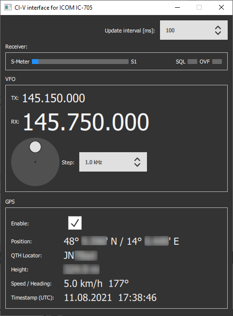
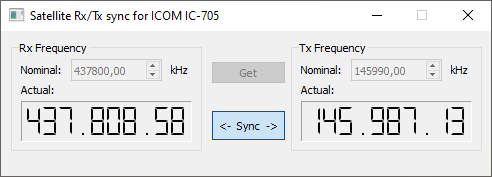

## QtCIV

QtCIV is a [Qt](https://www.qt.io/) C++ implementation of ICOM's CI-V protocol.

#### Supported transceiver

The applications provided are mainly intended to provide some basic functionality to communicate with [ICOM IC-705](https://www.icomjapan.com/lineup/products/IC-705/) amateur radio transceiver.
Similar devices like IC-7300, IC-9700,... may be supported as well. Please cross-check with the corresponding [CI-V reference manuals](https://www.icomjapan.com/support/manual/).

#### Project organization

***libCIV***
Library containing basic CI-V protocol functionality.

***libCIVTest***
Unit test project for libCIV.

***RemoteControl***
Qt QML based demo project making use of most of the functionality implemented in libCIV.

***SatSync***
Qt Widgets based project used to synchronize transmit frequency corresponding to receive frequency shift when making satellite communication (compensating Doppler shift).

